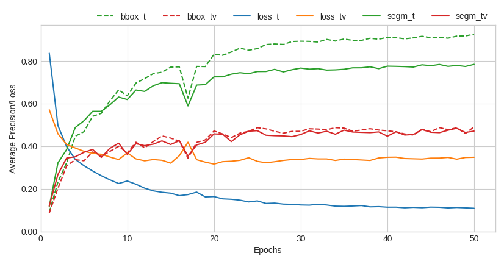
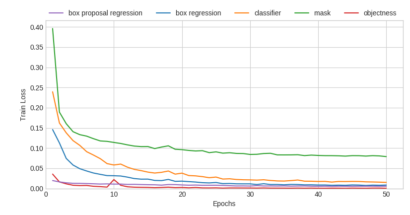
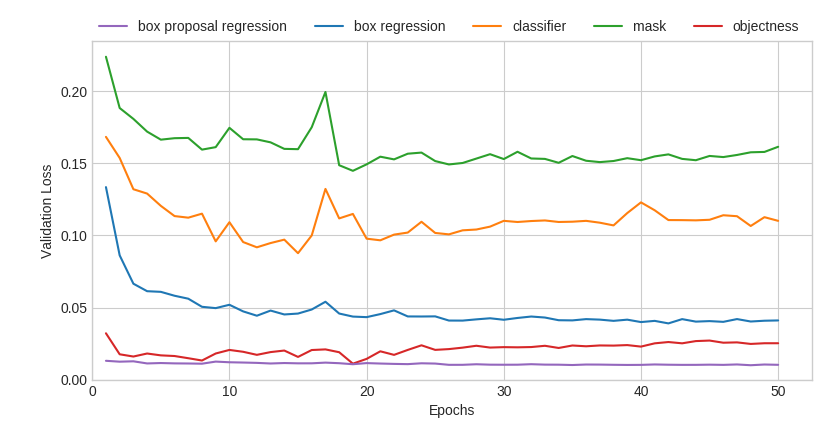

# InstSeg34405-GYN

This repository supplements the paper "[Instrument Recognition in Laparoscopy for Technical Skill Assessment](https://link.springer.com/chapter/10.1007/978-3-030-37734-2_48)". This implementation generates segmentation masks for each instrument, visible in gynecologic laparoscopy surgeries.

Provided artifacts:
* Dataset release (in progress ...)
* [Source code to train, and validate models](#trainval)
* [PyTroch model, trained on instseg34405-gyn](#download-the-model)
* [Source code to use the model with videos](#usage)

## Installation
* Set up a Python3 environment
* Install [PyTorch](https://pytorch.org) 1.1.0 and TorchVision 0.3.0
* Install dependencies:
```bash
pip install -r ./requirements.txt
```
* Clone this repository
* Set up repository with submodules
```bash
# Hints: Cloning, Pulling and Pushing with submodules
# clone this repo with submodules
git clone --recursive [URL to Git repo]
# pull all changes to this reopo and to submodules
git pull --recurse-submodules
# pull all changes to submodules only
git submodule update --remote
# push all changes
git submodule foreach git push origin master
# add submodule afterwards
cd ./
git submodule add -b master --name torchvision_mrcnn https://github.com/skletz/torchvision-mrcnn.git model/torchvision_mrcnn
git submodule init
```

## <a name="trainval"></a>Training and Validation
* [Download the dataset](#download-the-dataset)
* Set up env variables

```
cd experiment/.envs
nano .train
# set env for EXP_ROOT_DIR
EXP_ROOT_DIR=/path/to
```
* Set the path to dataset's input directory
```
DATA=${EXP_ROOT_DIR}/datasets
```
* Set the path to model's output directory
```
MODEL=${EXP_ROOT_DIR}/experiments
```
* Start training script
```
train.py --model_dir=${MODEL} --data_dir=${DATA}
```
### <a name="download-the-dataset"></a>Download the Dataset
```bash
# Download link
# In progress ...
```

## <a name="usage"></a>Usage
* Set up env variables
```
cd demo/.envs
nano .run_video
# set env for CUR_ROOT_DIR
CUR_ROOT_DIR=/path/to
```
* [Download the model](#download-the-model)
* Set up input variables
```
INPUT_VDO=${CUR_ROOT_DIR}/video.mp4
OUTPUT_DIR=${CUR_ROOT_DIR}/output/
MODEL=${CUR_ROOT_DIR}/path/to/model/instseg34405-gyn.pth.tar
```
* Start script
```
run_video.py --input=${INPUT_VDO} --output=${OUTPUT_DIR} --model=${MODEL}
```

### <a name="download-the-model"></a>Download the Model
Resulting model at epoch 48, i.e., after 5,856 iterations with 122 batches per epoch and 2 images per batch:
```bash
# Download link
# In progress ...
```

## Experimental Evaluation
### Quantitative Results
|  |
|:--:|
| *[Average precision](http://cocodataset.org/#detection-eval) and loss during training for 50 epochs.* |
| bbox=bounding box, segm=segmentation mask, t=training, tv=validation |

|  |  |
|:--:|:--:|
| *Individual training errors.* | *Individual validation errors.* |


### Qualitative Results
| <p>  </p> |
|:--:|
| *Grasping example.* |

| <p>  </p> |
|:--:|
| *Coagulation example.* |

## Citation
If you use this code base or the model trained on instseg34405-gyn in your work, please cite:
```
@inproceedings{kletz2020instseg34405,
  author="Kletz, Sabrina and Schoeffmann, Klaus and Leibetseder, Andreas
  and Benois-Pineau, Jenny and Husslein, Heinrich",
  title="Instrument Recognition in Laparoscopy for Technical Skill Assessment",
  year="2020",
  pages="589--600",
  isbn="978-3-030-37734-2",
  doi="10.1007/978-3-030-37734-2_48",
  url="https://link.springer.com/chapter/10.1007/978-3-030-37734-2_48",
  booktitle="MultiMedia Modeling",
  editor="Ro, Yong Man and Cheng, Wen-Huang and Kim, Junmo and Chu, Wei-Ta and Cui, Peng and Choi, Jung-Woo and Hu, Min-Chun and De Neve, Wesley",
  publisher="Springer International Publishing",
  address="Cham"
}
```

## Contact
For questions about our paper or code, please contact [Sabrina Kletz](sabrina@itec.at).
